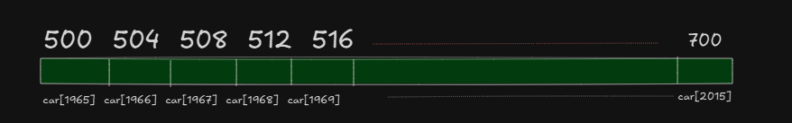

<!-- This is very important property of linear arrays (Linked list dose not have this property) -->

# Example 2.1 - 

```
A car manufacturing company uses an array to record number of cars sold each year starting from 1965 to 2015. 
rather than beginning the array index from 0 to 1, 
it is more useful to begin the array index from 1965 as shown below:
```



a. Find the total number of years 
b. Suppose base addrss = 500, word length w=4, find address of car[1967], car[1969] and car[2015]


# Solution 

a. Given 
```
Lower bound = lb = 1965
Upper Bound = ub = 2015 

so total number of years = 2015 - 1965 + 1 = 51 years total years
```
b. Given location to find for j respectively : 1967, 1969 and 2015 , w=4 , lb=1965

```

loc = bassadd + w * (j-lb)

1. loc(car[1967])= 500 + 4 * (1967-1965) = 508
2. loc(car[1969])= 500 + 4 * (1969-1965) = 516
3. loc(car[2015])= 500 + 4 * (2015-1965) = 700

```


