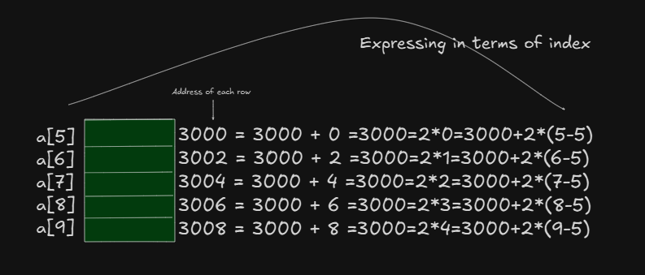

# Calculation of x :

```
loc A[j] = base address + x
```

- Given the base address, the distance from the base address can be obtained as shown below : 




so, distance from the base address 3000 = 2*(j-5)

```
x=w*(j-lb)
```

where:
- 2 represent size of integer i.e w in general 
5 represent the lower lb of the array 

Subsituting x in relation (1) we get 

```
loc A[j] = base address(a) + w * (j-lb)
```

where: 

- w is the word length. w = 2 for integer values 
                        w = 4 for floating point values 
                        w = 8 for double values

- j is the index of the array 
- lb is the lower bound of the array 
