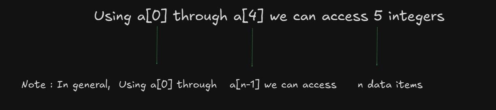

# Operations on Arrays

- Traversing 
- Inserting 
- Deleting
- Searching 
- Sorting 

# Traversing 

- "How to read the data from the keyboard and how to display data items stored in the array ?"

```
1. for-llop
2. while-loop
3. do-while
4. if-statement
5. switch-statement 
```

- Here, memory for 5 integers is reserved and each item in the array can be access by specifying the index :
```
int a[5];
```



- "How to store the data items in these locations which are read from the keyboard ?"

- This is achived by reading n data items from the keyboard using scanf() function which is available in C library as shown 

```
scanf("%d", &a[0]);
scanf("%d", &a[1]);
scanf("%d", &a[2]);
scanf("%d", &a[n-1]);

In general, scanf("%d", &a[i]) where i=0,1,2,3,.......,n-1
```

# Inserting 

- "How to insert an item into an unsorted array based on the position ?"

- Problem Statement: Given an array a consisting of n elements, it is required to insert an item at the specified position say pos.

- Desgin : An item can be inserted into the array by considering various situations as shown below:

- Step 1 : Elements are present (Invalid position): This case can be pictorially represented as 


```
    if(pos>n || pos 0){
        printf("Invalid position");
        return n;
    }
```

- Step 2 : Make room for the item to be inserted at the specified position: 
  - COnsider the following list with 7 elements and item 60 to be inserted at position 3.

  

  

  ```
    a[7] = a[6];
    a[6] = a[5];
    a[5] = a[4];
    a[4] = a[3];
    a[i+1] = a[i]; for i = 6 down to 3
                   for i= n-1 down to pos
  ```
  Now the code for the above activity can be written as shown below: 

  ```
    for(i=n-1;i>=pos;i--){
        a[i+1]=a[i]
    }
  ```

- Step 3 : Insert item at the specified position: The code can be written as shown below:


- Step 4 : Update number of elements in above array: The code for this case can be written as shown below:

 ```
  return n+1;
 ```
Now the complete function to insert an item at specified position can be written as shown