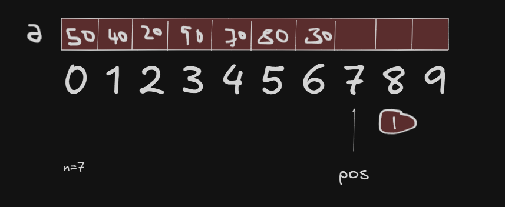
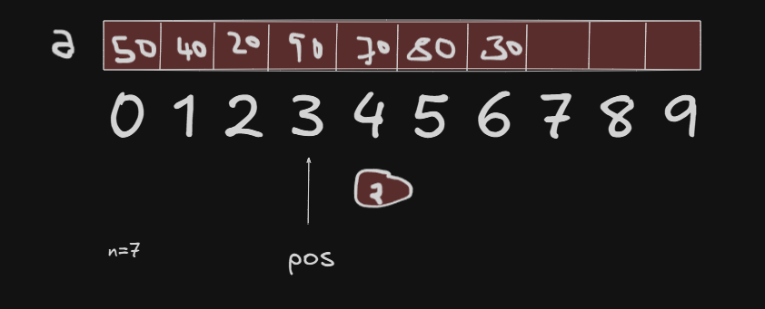
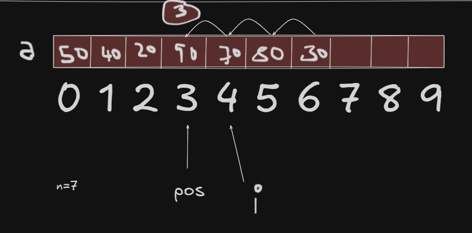
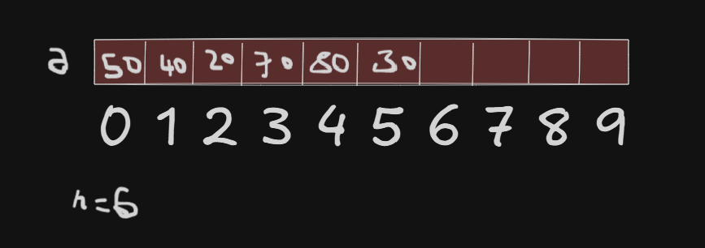

# Delete

- Deleting an item from an Array (Based on Position)

- "How to delete an item feom an unsorted array based on the positions?"

- Problem Statement : Given an array  a consisting of n elements, it is required to delete an item at the specifed position position say pos.

- Design : An item can be deleted from the array by considering various situations as shown below: 

- Step 1: Elements are present (Invalid position): This case can be pictorically repreented as shown below: 




```
    if(pos>n || pos<0){
        printf("Invalid positon\n");
        return n ;
    }
```

- Step 2 : Display the item to be deleted: Consider the following list with 7 elements and let the position pos is 3



- Step 3: Remove the item from the array : Removing an elemment at the given position can be illutrated using the following figure:




```
                a[3] = a[4];
                a[4] = a[5];
                a[5] = a[6];
In general ,    a[i-1]=a[i]; for i=4 to 6
                             for i=pos+1 to n-1


for(i=pos+1;i<n;i++){
    a[i-1]=a[i];
}
```

- Step 4 : Update number of elements in above array: After deleting an item the number of items in the array should be decremented by 1 It can be done using the following statement:



```
return n-1;
```