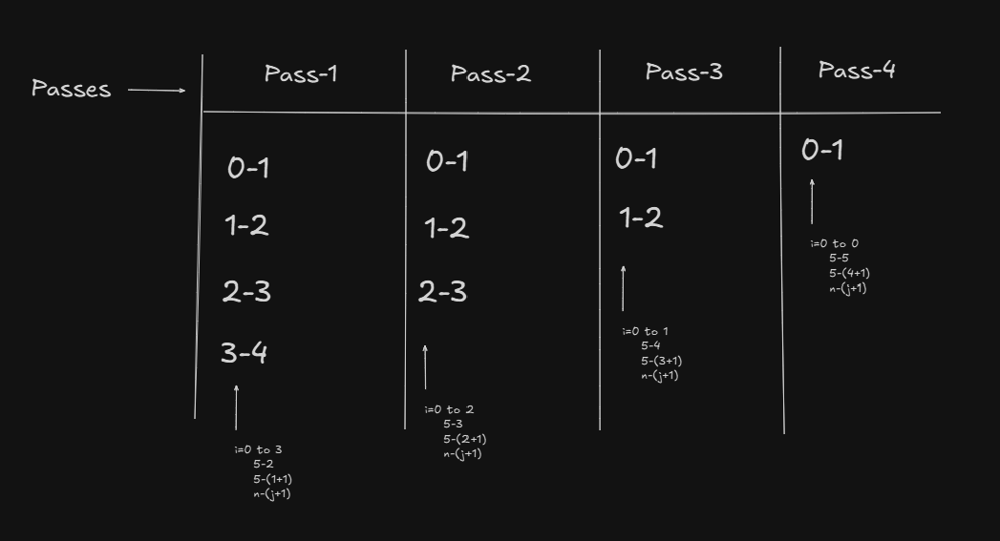

# 2.3.4 Sorting Array Elements

- More often programmers will be working with large amount of  data and it may be necessary to arrange them in ascending or descending order. This process of arraging the given elements so that they are in ascending order or descending order is called ```sorting```. 

- For example

- `10,50,25,20,15`

- After sorting them in ascending order, we get the following list:

- `10,15,20,25,50`

- After sorting them in descending order, we get the following list: 

- `50,25,20,15,10`

- Before writing the algorithm or the program let us knowthe answer for "What is the concept used in bubble sort (why it is also called sinking sort)?"

Step 1: Identify parameters to function: Given an array a consiting of n elements we have to sort them in ascending or descending order, So,


Step 2: Retuen type: Our intention is only to sort the numbers. Hence, we are not returning any value. So,


Step 3: Designing body of function: this is the simplest and easiest sorting technique. In this technique, the two successive items A[i] and A[i+1] are exchanged whenever A[i] >= A[i+1]. For example, consider the elemets shown below:

```50,40,30,20,10```

- The elements can be sorted as shown below:


- In the first pass 50 is compared with 40 and they are exchanged since 50 is greater than 40

- Next 50 is compared with 30 and they are exchanged since 50 is greater than 30. If we proceed in the same manner, at th eend of the first pass the largest item occupies the last position.

- On each sucessive pass, the items with the next largest value will be moved to the bootm and thus elements are arranged in ascending order.

Note : Observe that after each pass, the larger values sinks to the bottom of the array and hence it is called sinking sort. The following figure below shows the output of each pass. 


Note: Observe that the end of each pass smaller values gradually "bubble" their way upward to the top (like air bubbles moving to surface of water) and hence called bubble sort.

- Now we concentrate on the desigining aspects of this sorting technique. The comparisons that are performed in each pass are shown below:




- In general we can say i=0 to n-(j+1) or i=0 to n-j-1
- Here, j=1 to 4 represent pass number. In general j=1 to n-1.

So, The partial code can be written as 

```
for j=1 to n-1
    for i=0 to n-j-1
        if(A[i] >A[i+1])
            exchange(A[i],A[i+1])
        end if
    end if
end if
```


# 2.8 Algorthim for bubble sort 
```
Algorthim BubbleSort(a[],n)
    for j<-1 to n-1 do
        for i<- 0 to n-j-1 do 
            if( a[i] > a[i+1])
                temp <- a[i]
                a[i]<- a[i+1]
                a[i+1] <- temp
            end if
        end for
    end for
```


